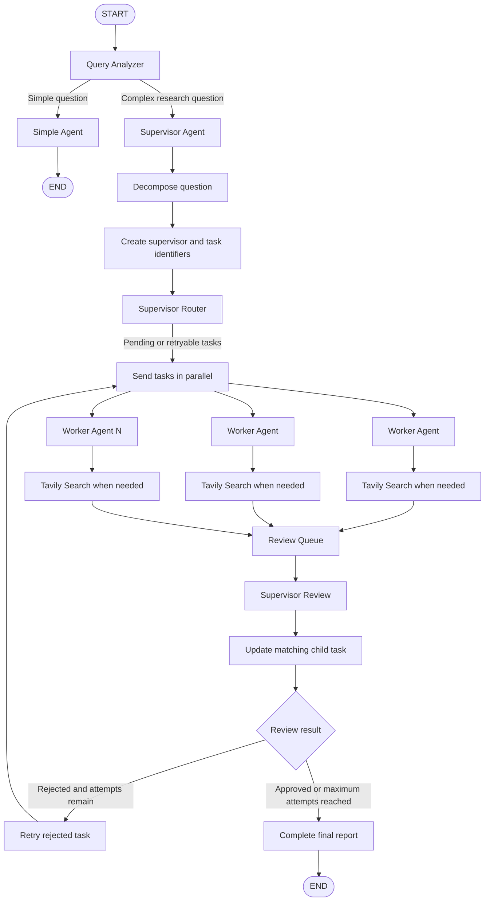

# Multi-Agent Research System

## Overview

This project is a multi-agent research workflow built with Python, LangGraph, LangChain, OpenAI, Pydantic, and Tavily Search.

The system analyzes a user's question, decides whether it needs a simple answer or deeper research, decomposes complex questions into independent tasks, sends those tasks to worker agents, reviews the worker results, retries rejected work, and produces a final report.

## Current Flow



## Step-by-Step Process

1. The user provides a `parent_question`.

2. `query_analyzer` uses structured output to classify the question.

3. The question is routed to one of two paths:
   - `simple_agent` answers directly.
   - `supervisor_agent` handles complex research questions.

4. The supervisor asks the LLM to split the complex question into focused task drafts.

5. Python creates the identifiers. The LLM does not create UUIDs:
   - One `supervisor_id` identifies the supervisor process.
   - Each child task receives its own `child_task_id`.
   - Each worker assignment receives its own `sub_agent_id`.

6. The task drafts are converted into complete `ChildTask` objects and stored in `SupervisorState["child_tasks"]`.

7. The supervisor router uses LangGraph `Send` to dispatch tasks independently. This allows the worker tasks to run in parallel.

8. Each worker receives a complete `ChildTask`, including:
   - `child_task_id`
   - `sub_agent_id`
   - `task`
   - `context`
   - `success_criteria`
   - Previous attempt history, when available

9. The worker builds its prompt using the task information, attempt number, and previous supervisor feedback.

10. The worker can call Tavily Search when the task requires current or externally verifiable information. It continues its tool-calling loop until the LLM returns its final response.

11. Each worker places its result in the shared `review_queue`. The result includes the task identifiers, task details, attempt number, and worker output.

12. The supervisor reviews each worker result using structured `ReviewOutput` data.

13. The matching `ChildTask` is updated with:
   - Review status
   - Attempt count
   - Attempt history
   - Supervisor feedback when rejected
   - Worker response in `final_output`

14. Rejected tasks with fewer than five attempts are sent back to workers. Approved tasks are preserved.

15. When no retryable tasks remain, the supervisor combines the approved findings and generates the `final_report`.

## Main State Objects

### `SupervisorState`

`SupervisorState` is the shared LangGraph state. It stores the parent question, routing information, child tasks, review results, and final report.

Important fields include:

```text
supervisor_id
parent_question
agent_type
child_tasks
n_agents
review_queue
reviewed_count
approved_outputs
rejected_outputs
final_report
```

### `ChildTaskDraft`

`ChildTaskDraft` represents the task information returned by the supervisor LLM. It contains only:

```text
task
context
success_criteria
```

It does not contain UUIDs. This prevents the LLM from being responsible for system identifiers.

### `ChildTask`

`ChildTask` is the complete task stored in the graph state. Python creates it from a `ChildTaskDraft` and adds:

```text
child_task_id
sub_agent_id
status
attempts
final_output
```

## Review and Retry Logic

Each worker result is reviewed by the supervisor.

- If approved, the result is added to the approved findings.
- If rejected, the feedback is saved in the task's attempt history.
- A rejected task is retried while its attempt count is below five.
- The next worker attempt receives the previous supervisor feedback.
- The worker's latest response is stored in that task's `final_output`.

The task ID is used to match every worker result with the correct `ChildTask`.

## Separation of Responsibilities

### Supervisor

The supervisor is responsible for:

- Decomposing the parent question
- Creating and assigning task identifiers
- Sending tasks to workers
- Reviewing worker results
- Providing retry feedback
- Tracking task status and attempts
- Producing the final report

### Worker

Each worker is responsible for:

- Following one assigned task
- Using its context and success criteria
- Searching with Tavily when necessary
- Returning structured findings

### LLM

The LLM is responsible for:

- Classifying questions
- Creating task drafts
- Researching assigned tasks
- Reviewing worker findings
- Generating the final report heading or report content

The application code remains responsible for identifiers, state management, task matching, and retry tracking.

## Current Limitations

- The current workflow uses an in-process graph invocation.
- The API and user interface are not part of the current implementation.
- Deployment is not part of the current implementation.
- Research quality still depends on the worker output, search results, prompt quality, and supervisor review.
- A worker response must follow the expected JSON structure for the review queue to process it successfully.

## Future Plans

Future plans include integrating a RAG-powered chatbot, developing a FastAPI REST API, building an interactive Next.js interface, and deploying the complete multi-agent research system for real-world use.
